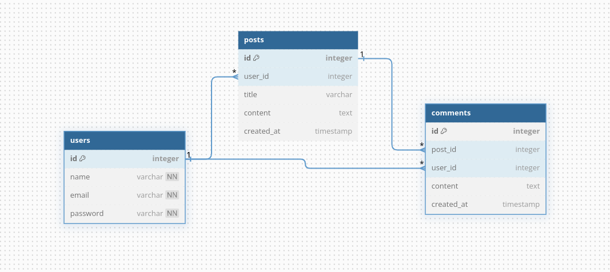

# post-comment
This repository hosts the code for a post-comment service apis.

### Tech Stack:
- I have used Golang's Echo framework for building the apis. Reason? Well nothing special it's just that I have been working with echo framework in my previous internship, and it was just convenient for me to use it.
- For the database I have used Postgres which is running as a Docker container.
- Both api server and database can be started by just a simple `docker compose up --build` command.

### Database Schema


### Run Locally
1. Clone this repository
2. create a `.env` file from `.env.template` in the root directory
3. Start the server
    ```bash
   docker compose up --build
   ```

### Endpoints:

- Access Postman collection with all the endpoints via this [link](https://www.postman.com/sachinkant/my-workspace/collection/iu69wbi/post-comment?action=share&creator=25924538)

User:
- POST: `localhost:8080/api/user/signup`
- POST: `localhost:8080/api/user/login`

Post:

- POST: `localhost:8080/api/post`
- GET: `localhost:8080/api/post/:id`
- DELETE: `localhost:8080/api/post/:id`

Comments:

- POST: `localhost:8080/api/comment`
- GET: `localhost:8080/api/comment/:id`
- DELETE: `localhost:8080/api/comment/:id`